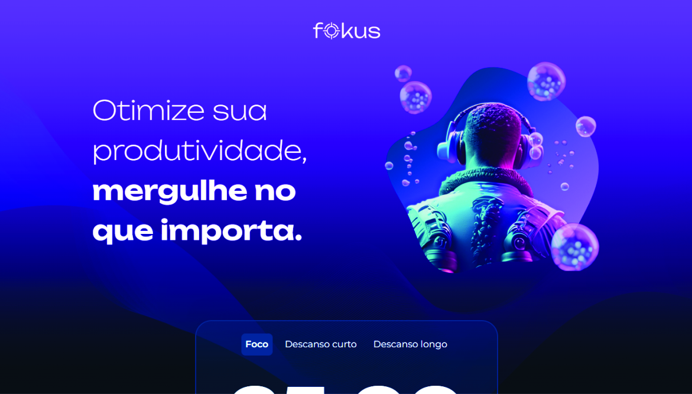
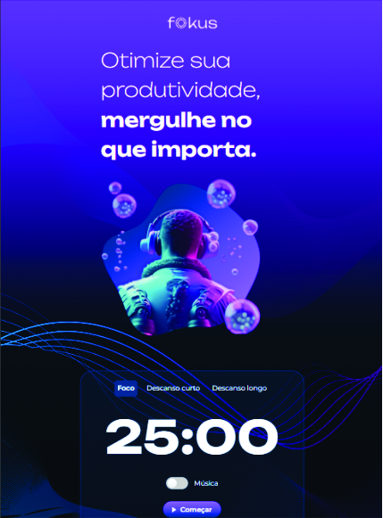
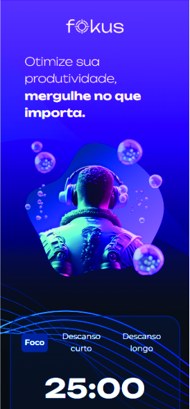
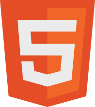
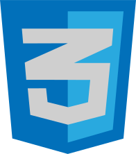
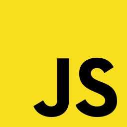

<h1>Projeto Fokus</h1>

O projeto Fokus tem como objetivo para você que não sabe ou quer saber o tempo ideal para seus estudos com foco ou para alguma outra tarefa que você desejar. Na página você pode adicionar a tarefa que você precisa executar como por exemplo: "Estudar sobre as atualidades do mundo" e salvar em seguida executar o cronômetro de de "Foco" no botão "Começar" que iniciará o cronômetro de 25 minutos, você também pode ativar a música de fundo no input logo a cima do botão começar. Depois que o cronômetro zerar irá executar um som de término e indicamos que você coloque o cronômetro de "Descanso curto" no tempo de 5 minutos ou "Descanso longo" no tempo de 15 minutos para fazer uma pausa e descansar a mente.

<h2>🖥️ Layout para desktop</h2>

<h2>📱 Layout para tablet</h2>

<h2>📱 Layout para mobile</h2>

<h2>Tecnologias utilizadas</h2>

<h2>Recursos do projeto</h2>

✅ Responsividades: O site foi cuidadosamente projetado para se adaptar de forma fluida a diferentes tamanhos de tela. Isso assegura uma experiência consistente e agradável em dispositivos móveis, tablets e desktops.

✅ Acessibilidade: Foi dada especial atenção à acessibilidade, garantindo que o site seja utilizável por todos os públicos, independentemente de suas habilidades.

<a href="https://fernando-silvaa.github.io/Projeto-Fokus/" style="background-color: grey; color: black; padding: 1rem; border-radius: 10px">Ver projeto</a>